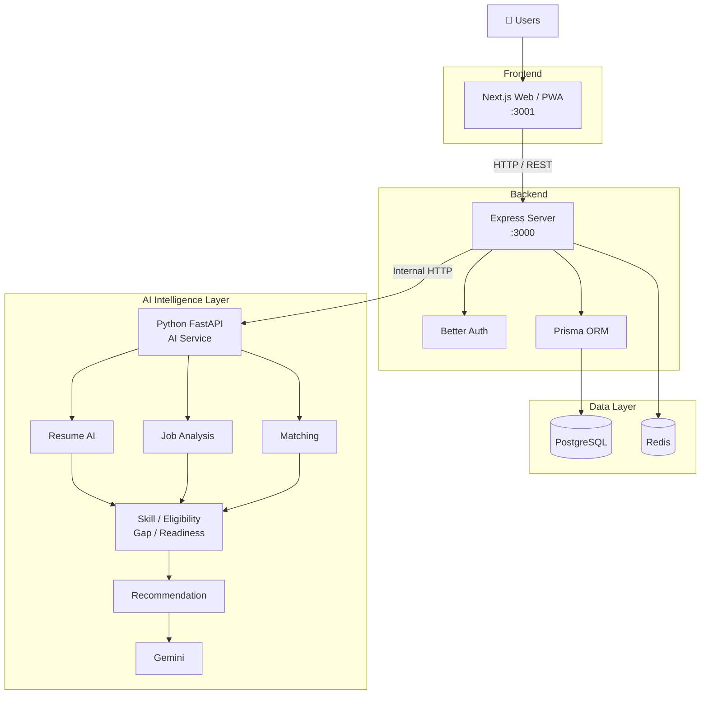

# CampusLink

> **AI-powered placement management platform** built on a modern TypeScript monorepo architecture.

CampusLink is a full-stack placement management platform designed for students, recruiters, colleges, and administrators.

The platform provides authentication, student and company management, job management, applications, assessments, readiness tracking, recommendations, and an extensible AI intelligence layer.

The project is built on the **Better-T-Stack** foundation and uses Next.js, Express, PostgreSQL, Prisma, Better Auth, Docker, PWA support, and pnpm. The architecture is designed so that AI/NLP capabilities can evolve independently from the main application.

---

## ✨ Features

- **TypeScript** — End-to-end type safety
- **Next.js** — Modern React frontend
- **Express.js** — Backend API and business logic
- **Node.js** — Backend runtime
- **Tailwind CSS** — Utility-first styling
- **shadcn/ui** — Shared UI primitives
- **PostgreSQL** — Primary relational database
- **Prisma** — Type-safe ORM
- **Better Auth** — Authentication and session management
- **Redis** — Caching, OTP/rate limiting, and supporting services
- **Husky** — Git hooks and development quality checks
- **PWA** — Progressive Web App support
- **Docker** — Containerized development and deployment
- **Varlock** — Environment configuration and validation
- **AI-ready architecture** — Designed for custom AI/NLP services and Gemini integration
- **Monorepo architecture** — Shared packages and centralized tooling

## 🏗️ System Architecture

CampusLink follows a modular architecture that separates the web application, backend API, data layer, and AI intelligence layer.



## 📁 Project Structure

```text
CampusLink/
│
├── apps/
│   ├── web/                    # Next.js frontend / PWA
│   │
│   └── server/                 # Express API + Better Auth
│
├── packages/
│   ├── ui/                     # Shared shadcn/uicomponents
│   │
│   ├── auth/                   # Better Auth configuration
│   │
│   ├── db/                     # Prisma + PostgreSQL
│   │
│   └── redis/                  # Redis client/configuration
│
├── docker-compose.yml
├── pnpm-workspace.yaml
├── package.json
├── bts.jsonc
└── README.md
```

The architecture is designed to allow additional AI services to be added under `apps/` without coupling them to the frontend or authentication layer.

---

# 🚀 Getting Started

## Prerequisites

Make sure you have installed:

- Node.js
- pnpm
- Docker Desktop
- PostgreSQL, or PostgreSQL through Docker
- Git

Check your versions:

```bash
node -v
pnpm -v
docker --version
git --version
```

---

## 📦 Installation

Clone the repository:

```bash
git clone https://github.com/ChandrakantaMandal/CampusLink
cd CampusLink
```

Install dependencies:

```bash
pnpm install
```

---

# ⚙️ Environment Configuration

CampusLink uses **Varlock** for environment configuration and validation.

Each application owns its environment schema through `.env.schema`.

After changing an environment schema, regenerate the environment types:

```bash
pnpm run env:generate
```

Environment schemas should be committed to Git.

Secrets should remain inside ignored `.env` files or your deployment platform.

### Typical services

```text
Next.js
   │
   └── NEXT_PUBLIC_SERVER_URL

Express
   │
   ├── BETTER_AUTH_URL
   ├── BETTER_AUTH_SECRET
   ├── CORS_ORIGIN
   ├── SMTP_*
   └── GOOGLE_*

PostgreSQL
   │
   └── DATABASE_URL

Redis
   │
   ├── REDIS_URL
   └── REDIS_TOKEN
```

Never expose private API keys, database credentials, SMTP passwords, or Gemini API keys to the browser.

---

# 🗄️ Database

CampusLink uses **PostgreSQL + Prisma**.

Generate the Prisma client:

```bash
pnpm run db:generate
```

Push the current Prisma schema:

```bash
pnpm run db:push
```

Run migrations:

```bash
pnpm run db:migrate
```

Open Prisma Studio:

```bash
pnpm run db:studio
```

After modifying the Prisma schema, regenerate the client:

```bash
pnpm run db:generate
```

---

# 🔴 Redis

Redis is used for supporting application services such as OTP handling and rate limiting.

### Start Redis

```bash
pnpm run redis:start
```

### Watch Redis logs

```bash
pnpm run redis:watch
```

### Stop Redis

```bash
pnpm run redis:stop
```

### Remove the Redis container

```bash
pnpm run redis:down
```

---

# 🔐 Authentication

Authentication is handled by **Better Auth**.

The authentication layer supports:

- Email/password authentication
- Email verification
- Signup OTP
- OTP resend
- Password reset
- Google OAuth
- Session management
- Secure cookies
- Authentication rate limiting

Better Auth manages identity and sessions. Application/business logic remains in the Express backend. The AI service does not implement its own user authentication.

---

# 📧 Email System

CampusLink uses SMTP/Nodemailer for transactional emails.

Current email functionality includes:

```text
Signup
   │
   └── OTP verification email

Forgot Password
   │
   └── Password reset email

Google / verified signup
   │
   └── Welcome email
```

SMTP configuration is supplied through the application's environment configuration.

---

# 🤖 AI Architecture

The AI layer is designed as a separate service rather than putting all AI logic directly inside Express.

The planned architecture uses:

```text
Next.js
   ↓
Express
   ↓
Python FastAPI
   ↓
AI/NLP Processing
   ↓
Structured JSON
   ↓
Express
   ↓
Next.js
```

The AI service can provide:

- Resume parsing
- Skill extraction
- Skill normalization
- Job analysis
- Eligibility evaluation
- Candidate matching
- Skill-gap analysis
- Readiness evaluation
- Recommendations

These responsibilities are defined as separate AI/placement engines in the architecture.

---

# 🧠 Placement Intelligence

CampusLink is designed around **deterministic placement intelligence**, rather than sending every operation directly to an LLM.

### Eligibility

Eligibility rules can evaluate:

- CGPA
- Degree
- Branch
- Graduation year
- Backlogs
- Experience

For example:

```text
Job Requirement:
CGPA >= 7.0

Student:
CGPA = 8.2

Result:
ELIGIBLE
```

Eligibility should remain rule-based so explicit placement requirements are not overridden by an LLM.

### Matching

Candidate and job requirements can be compared using:

- Skills
- Projects
- Experience
- Assessments
- Other configurable factors

Example:

```text
Student:
Python, SQL, React, Git

Job:
Python, SQL, Git, Docker

Matched:
Python
SQL
Git

Missing:
Docker
```

### Skill Gap

```text
Required Skills - Candidate Skills = Skill Gap
```

Example:

```text
Required:
Python, SQL, Docker, AWS

Candidate:
Python, SQL, React

Skill Gap:
Docker, AWS
```

### Readiness

The readiness engine can combine configurable factors such as:

```text
Academics       20%
Technical Skills 30%
Projects        20%
Resume          10%
Assessments     20%
```

These values are product-defined configuration rather than an objective measurement of a student's overall ability.

---

# ✨ Gemini Integration

Gemini is intended to **complement** the custom placement intelligence rather than replace it.

Potential Gemini use cases include:

- AI chat
- Resume improvement suggestions
- Job-description summaries
- Interview questions
- Learning plans
- Natural-language explanations
- Presentation of structured recommendations

The core eligibility, matching, skill-gap, and readiness calculations remain controlled by CampusLink's own application logic.

The Google API key must remain server-side and must never be exposed to the browser.

---

# 🔎 RAG

RAG is an optional extension for unstructured institutional information such as:

- Placement policies
- College handbooks
- Recruitment rules
- Notices
- FAQs
- Long-form college documentation

A possible architecture is:

```text
Documents
   ↓
Text Extraction
   ↓
Chunking
   ↓
Embeddings
   ↓
Vector Storage
   ↓
Similarity Search
   ↓
Relevant Context
   ↓
Gemini
   ↓
Grounded Answer
```

PostgreSQL with `pgvector` can be used if RAG is introduced because PostgreSQL is already the project's primary database.

---

# 🎨 UI Customization

Shared shadcn/ui components live inside:

```text
packages/ui
```

Global styles:

```text
packages/ui/src/styles/globals.css
```

Shared components:

```text
packages/ui/src/components/
```

Add additional shared shadcn components:

```bash
npx shadcn@latest add accordion dialog popover sheet table -c packages/ui
```

Use shared components:

```tsx
import { Button } from "@CampusLink/ui/components/button";
```

For application-specific components, run the shadcn CLI from:

```text
apps/web
```

---

# 🧪 Development

Start the complete development environment:

```bash
pnpm run dev
```

Frontend:

```text
http://localhost:3001
```

Backend API:

```text
http://localhost:3000
```

Start only the frontend:

```bash
pnpm run dev:web
```

Start only the backend:

```bash
pnpm run dev:server
```

---

# 🐳 Docker

CampusLink supports Docker Compose for local development and deployment.

### Build images

```bash
pnpm run docker:build
```

### Start services

```bash
pnpm run docker:up
```

### View logs

```bash
pnpm run docker:logs
```

### Stop services

```bash
pnpm run docker:down
```

The Docker architecture can include:

```text
docker-compose.yml
│
├── web
├── server
├── postgres
├── redis
└── ai
```

The AI service should normally remain private and communicate with Express through the internal Docker network. For example:

```text
http://ai:8000
```

rather than:

```text
http://localhost:8000
```

when communicating between containers.

---

# 🛡️ Security

Important security principles:

- Keep Better Auth secrets server-side
- Keep Google OAuth secrets server-side
- Keep SMTP credentials server-side
- Keep Gemini API keys server-side
- Validate API request payloads
- Rate-limit expensive operations
- Validate uploaded resume file types
- Limit uploaded file sizes
- Add request timeouts
- Keep the FastAPI AI service private in production
- Use an internal API/service key between Express and FastAPI
- Avoid logging sensitive resume information unnecessarily

These controls are part of the recommended AI-service security architecture.

---

# 🪝 Git Hooks

Initialize Husky:

```bash
pnpm run prepare
```

Husky can be used to run code-quality checks before commits.

---

# 📱 PWA

The web application supports Progressive Web App functionality.

Generate PWA assets:

```bash
cd apps/web
pnpm run generate-pwa-assets
```

---

# 🧰 Available Scripts

| Command                                       | Description                        |
| --------------------------------------------- | ---------------------------------- |
| `pnpm run dev`                                | Start all applications             |
| `pnpm run dev:web`                            | Start Next.js frontend             |
| `pnpm run dev:server`                         | Start Express backend              |
| `pnpm run build`                              | Build all applications             |
| `pnpm run check-types`                        | Check TypeScript types             |
| `pnpm run db:generate`                        | Generate Prisma client             |
| `pnpm run db:push`                            | Push Prisma schema                 |
| `pnpm run db:migrate`                         | Run database migrations            |
| `pnpm run db:studio`                          | Open Prisma Studio                 |
| `pnpm run env:generate`                       | Generate Varlock environment types |
| `pnpm run auth:generate`                      | Generate Better Auth schema        |
| `pnpm run prepare`                            | Initialize Husky                   |
| `pnpm run redis:start`                        | Start Redis                        |
| `pnpm run redis:watch`                        | Start Redis and show logs          |
| `pnpm run redis:stop`                         | Stop Redis                         |
| `pnpm run redis:down`                         | Remove Redis container             |
| `pnpm run docker:build`                       | Build Docker images                |
| `pnpm run docker:up`                          | Build and start Docker services    |
| `pnpm run docker:logs`                        | Show Docker logs                   |
| `pnpm run docker:down`                        | Stop Docker services               |
| `cd apps/web && pnpm run generate-pwa-assets` | Generate PWA assets                |

---

# 🔧 Better Auth Schema Generation

After changing Better Auth plugins or schema configuration:

```bash
pnpm run auth:generate
```

Review the generated schema changes before applying them.

Then use the Prisma migration workflow:

```bash
pnpm run db:migrate
```

---

# 🔄 Typical Development Workflow

A typical development workflow is:

```bash
# Install dependencies
pnpm install

# Generate environment types
pnpm run env:generate

# Generate Prisma client
pnpm run db:generate

# Start PostgreSQL / application services
docker compose up -d

# Start Redis
pnpm run redis:start

# Apply database schema
pnpm run db:push

# Start development
pnpm run dev
```

---

# 🧪 Testing

The AI architecture supports multiple testing layers:

### Unit Tests

Test deterministic placement logic:

- Skill normalization
- Eligibility
- Matching
- Skill gaps
- Readiness calculations

### API Tests

Test each FastAPI endpoint.

### Integration Tests

Test:

```text
Next.js
   ↓
Express
   ↓
FastAPI
   ↓
PostgreSQL
```

### AI Evaluation

Maintain datasets containing:

- Example resumes
- Expected extracted skills
- Job descriptions
- Expected requirements
- Expected matching results

Regression tests can then verify that previously analyzed documents continue to produce acceptable results.

---

# 🗺️ Development Roadmap

### Phase 1 — Platform Foundation

- Next.js
- Express
- PostgreSQL
- Prisma
- Better Auth
- Docker

### Phase 2 — Resume Intelligence

- PDF upload
- Text extraction
- Resume section detection
- Skill extraction
- Skill normalization

### Phase 3 — Job Intelligence

- Job description analysis
- Required skills
- Preferred skills
- Eligibility extraction

### Phase 4 — Candidate Matching

- Eligibility filtering
- Skill matching
- Explainable match results

### Phase 5 — Skill Gap

- Missing skills
- Skill priorities
- Target-job analysis

### Phase 6 — Readiness

- Academic factors
- Technical skills
- Projects
- Resume
- Assessments

### Phase 7 — Recommendations

- Learning recommendations
- Project recommendations
- Interview preparation

### Phase 8 — Gemini

- AI chat
- Explanations
- Interview preparation
- Learning plans

### Phase 9 — RAG

- Document ingestion
- Embeddings
- Vector search
- Grounded answers

This phased architecture allows the platform to begin with deterministic algorithms and evolve toward more advanced AI capabilities without requiring a complete rewrite.

---

# 🤝 Contributing

1. Create a feature branch:

```bash
git switch -c feature/your-feature
```

2. Make your changes.

3. Run type checking:

```bash
pnpm run check-types
```

4. Run the appropriate tests and builds.

5. Commit your changes:

```bash
git add .
git commit -m "feat: add your feature"
```

6. Push the branch:

```bash
git push -u origin feature/your-feature
```

7. Open a pull request.

---

## 📝 Commit Convention

CampusLink follows the **Conventional Commits** specification to keep the Git history clean, consistent, and easy to understand.

### Commit Types

| Type       | Purpose                                    | Example                                      |
| ---------- | ------------------------------------------ | -------------------------------------------- |
| `feat`     | Add a new feature                          | `feat: add Google OAuth authentication`      |
| `fix`      | Fix a bug or issue                         | `fix: resolve password reset redirect`       |
| `docs`     | Documentation, README, or license changes  | `docs: update project architecture`          |
| `chore`    | Maintenance and configuration changes      | `chore: update Redis docker scripts`         |
| `refactor` | Restructure code without changing behavior | `refactor: simplify mailer configuration`    |
| `build`    | Build system or dependency configuration   | `build: update pnpm workspace configuration` |
| `ci`       | CI/CD configuration                        | `ci: add GitHub Actions workflow`            |
| `test`     | Add or modify tests                        | `test: add authentication tests`             |
| `style`    | Formatting or code-style changes           | `style: format authentication service`       |
| `perf`     | Performance improvements                   | `perf: optimize Redis rate limiting`         |
| `revert`   | Revert a previous commit                   | `revert: revert OAuth authentication`        |

### Examples

```text
feat: add Google OAuth authentication
fix: resolve password reset redirect
docs: update project architecture
docs: add MIT license information
chore: update Redis docker scripts
chore: update dependencies
refactor: simplify mailer configuration
feat: add signup OTP verification
fix: resolve email verification flow
build: update pnpm workspace configuration
ci: add GitHub Actions workflow
test: add authentication tests
style: format authentication service
perf: optimize Redis rate limiting
```

### Commit Format

Use the following format:

```text
<type>: <short description>
```

For example:

```text
feat: add signup OTP verification
```

For more detailed commits, an optional scope can be used:

```text
feat(auth): add Google OAuth authentication
fix(auth): resolve password reset redirect
docs(readme): update project architecture
chore(redis): update Docker configuration
```

### Recommended Guidelines

- Use **imperative mood**: `add`, `fix`, `update`, `remove`
- Keep the subject short and clear
- Use lowercase for the commit type
- Do not end the subject with a period
- Use `feat` for user-facing functionality
- Use `fix` for bug fixes
- Use `docs` for README, documentation, and license changes
- Use `chore` for maintenance that does not change application behavior
- Use `refactor` when restructuring code without changing its behavior

### Example Git Workflow

```bash
git add .
git commit -m "feat: add Google OAuth authentication"
git push origin main
```

For a documentation-only change:

```bash
git add README.md LICENSE
git commit -m "docs: update README and add MIT license"
git push origin main
```

---

# 📄 License

This project is licensed under the MIT License.

---

## 🧱 Technology Stack

| Layer                 | Technology       |
| --------------------- | ---------------- |
| Frontend              | Next.js          |
| Styling               | Tailwind CSS     |
| UI                    | shadcn/ui        |
| Backend               | Express.js       |
| Runtime               | Node.js          |
| Database              | PostgreSQL       |
| ORM                   | Prisma           |
| Authentication        | Better Auth      |
| Cache / Rate Limiting | Redis            |
| AI Service            | Python + FastAPI |
| Generative AI         | Google Gemini    |
| AI SDK                | Vercel AI SDK    |
| Package Manager       | pnpm             |
| Containers            | Docker           |
| Git Hooks             | Husky            |
| PWA                   | Next.js PWA      |
| Environment           | Varlock          |

---

## 📌 Architecture Principle

CampusLink is designed as a **placement intelligence system**, not simply an application that sends every task to an LLM.

### Deterministic Intelligence

```text
Eligibility
Matching
Skill Gap
Readiness
Skill Normalization
```

### Generative Intelligence

```text
Explanations
AI Chat
Learning Plans
Interview Preparation
Document Understanding
```

The application architecture keeps PostgreSQL as the source of truth for structured placement data, while the AI service handles custom NLP and intelligence workloads. Gemini provides natural-language capabilities where they add value.

---

## 🚀 Built for Evolution

CampusLink is designed to evolve from an MVP into a larger placement intelligence platform.

The architecture allows additional capabilities such as:

- Advanced resume intelligence
- Candidate ranking
- AI-powered recommendations
- Interview preparation
- AI chat
- Institutional document search
- RAG
- Vector search
- Advanced analytics
- Additional AI models

without requiring the core Next.js, Express, PostgreSQL, Prisma, and Better Auth architecture to be replaced.
